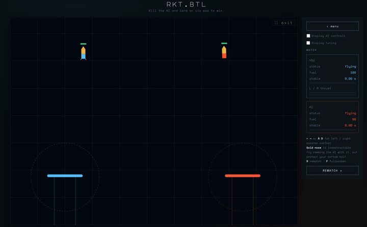

# RKT.BTL

A 2D rocket battle game with a deterministic physics core in Rust. One physics
implementation drives both an in-browser game (WebAssembly) and an RL training
stack (Python / Gymnasium), so they can never drift apart.



Fly a rocket with two on/off boosters and land on your opponent's floating pad
before its AI lands on yours. You can wreck the other rocket by ramming its
engines, but wrecking it does not win the game, you still have to set down.

## Controls

- Left / Right boosters: arrow keys, or A and D.
- Both at once: straight thrust.
- R: rematch.

## Layout

```
crates/
  core/   rocket-core    deterministic physics + game logic (no I/O)
  py/     rocket-lander   PyO3 bindings: Sim, VecSim, Gymnasium env
  wasm/   rocket-wasm     wasm-bindgen frontend bindings
web/        browser frontend (sandbox + versus game)
```

The physics is fixed-step semi-implicit Euler with spring-damper landing legs,
Coulomb friction, fuel, and capsule hull collisions. Every tunable lives in
`Cfg::default()` (`crates/core/src/config.rs`); the hand-tuned values there are
the ones the game ships with.

The opponent AI is a simple cascaded PD guidance law (`Game::ai_action`), a
drop-in placeholder for a learned RL policy.

## Build and run

Prereqs: `rustup` (with the `wasm32-unknown-unknown` target), `wasm-bindgen-cli`,
and a Python venv for the RL bindings.

```bash
# Rust core + game tests
cargo test -p rocket-core

# Browser build
./scripts/build-wasm.sh                          # -> web/pkg/
python -m http.server 8011 --directory web       # open http://localhost:8011/game.html

# Python extension + tests
cd crates/py && maturin develop --release && cd ../..
python -m pytest crates/py/tests
```

`web/index.html` is the single-rocket sandbox (keyboard + tuning sliders);
`web/game.html` is the versus game.

## RL usage

```python
from rocket_lander import Sim, VecSim
sim = Sim(randomize=True)
obs = sim.reset(seed=0)
obs, reward, terminated, truncated, info = sim.step(1)   # 0=coast 1=L 2=R 3=both

# vectorised: one Rust call steps all envs, with auto-reset
import numpy as np
vec = VecSim(4096, randomize=True, seed=0)
obs = vec.reset()
obs, rew, term, trunc = vec.step(np.zeros(4096, dtype=np.int64))

# Gymnasium
import gymnasium as gym, rocket_lander            # registers the id
env = gym.make("RocketLander-v0")
```

Observation (length 12):

```
[x/W, y/H, vx/10, vy/10, sin th, cos th, w/5, fuel/max,
 (pad.x - x)/W, (pad.y - y)/H, legs_out, stable_time/need]
```

Physics tunables pass as kwargs, e.g. `Sim(m=2.0, tmax=30, infinite_fuel=True)`.
